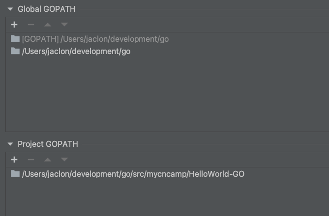

参考网址：
- the-way-to-go https://learnku.com/docs/the-way-to-go
github: https://github.com/Unknwon/the-way-to-go_ZH_CN
- go语言设计与实现 https://draveness.me/golang/
- C语言编程网： http://c.biancheng.net/golang/


# 安装和环境变量

- mac下安装： brew install
- 环境变量
  - GOROOT go的安装目录
  - GOPATH
      - src:存放源代码
      - pkg:存放依赖包
      - bin:存放可执行文件
  - 其他常用变量 GOOS，GOARCH，GOPROXY
  - 建议
  国内用户建议设置goproxy:export GOPROXY=https://goproxy.cn
  参考https://learnku.com/docs/the-way-to-go/go-environment-variable/3565
  多项目工程中使用GOPATH： http://c.biancheng.net/view/88.html
  - 本地实践：
    GOPATH配置在/etc/zprofile
    项目源码最终放在了development/go/src下,不同项目在不同的包中。
    IDEA可以配置GLOBAL PATH和PROJECT PATH 
- 基本命令
  - build
  - install
  - test
  - vet

**追加**
单独使用go path 会导致版本问题.
现在一般通过go mod管理依赖，注意需要删除IDEA go path配置，会和go mod冲突

# 基本语法和数据结构

- 数组和切片： 
  - 切片是对数组一个连续片段的引用，数组定义中不指定长度即为切片
  - 切片在未初始化之前默认为nil，长度为0
  - 切片的remove比较复杂
  - 切片赋值：make和new 
    - New返回指针地址
    - Make返回第一个元素，可预设内存空间，避免未来的内存拷贝
- Map
- 指针和地址
  - C语言中*和&的区别：https://blog.csdn.net/qq_20366761/article/details/52903953
  *是指针运算符，可以表示一个变量是指针类型；
  也可以表示一个指针变量的所指向的存储单元，可以获取某个地址存储的值。
    - go语言中一个指针变量可以指向任何一个值的内存地址 
      - 可以在指针类型前面加上 * 号（前缀）来获取指针所指向的内容，这里的 * 号是一个类型更改器。
      - 使用一个指针引用一个值被称为间接引用。符号 * 可以放在一个指针前，如 *intP，那么它将得到这个指针指向地址上所存储的值；这被称为反引用（或者内容或者间接引用）操作符
      - 当一个指针被定义后没有分配到任何变量时，它的值为 nil
      - 你不能得到一个文字或常量的地址
      ```cgo
      const i = 5
      ptr := &i //error: cannot take the address of i
      ptr2 := &10 //error: cannot take the address of 10
      ```
      - go语言不允许指针运算
      - 对一个空指针的反向引用是不合法的
      ```cgo
      package main
      func main() {
        var p *int = nil
         *p = 0
      }
         // in Windows: stops only with: <exit code="-1073741819" msg="process crashed"/>
      // runtime error: invalid memory address or nil pointer dereference
      ```

  >new 和 make 均是用于分配内存：
  new 用于值类型和用户定义的类型，如自定义结构，make 用于内置引用类型（切片、map 和管道）。
  它们的用法就像是函数，但是将类型作为参数：new (type)、make (type)。
  new (T) 分配类型 T 的零值并返回其地址，也就是指向类型 T 的指针。它也可以被用于基本类型：v := new(int)。
  make (T) 返回类型 T 的初始化之后的值，因此它比 new 进行更多的工作

# 打印

```cgo
package main

import (
    "fmt"
    "strconv"
)

type TwoInts struct {
    a int
    b int
}

func main() {
    two1 := new(TwoInts)
    two1.a = 12
    two1.b = 10
    fmt.Printf("two1 is: %v\n", two1)
    fmt.Println("two1 is:", two1)
    fmt.Printf("two1 is: %T\n", two1)
    fmt.Printf("two1 is: %#v\n", two1)
}

func (tn *TwoInts) String() string {
    return "(" + strconv.Itoa(tn.a) + "/" + strconv.Itoa(tn.b) + ")"
}
```
输出
```cgo
two1 is: (12/10)
two1 is: (12/10)
two1 is: *main.TwoInts
two1 is: &main.TwoInts{a:12, b:10}
```

# 包导入&程序结构

包导入只执行它的 init 函数并初始化其中的全局变量
```go
import with _ :
import _ "./pack1"
# pack1 包只导入其副作用，也就是说，只执行它的 init 函数并初始化其中的全局变量。
```

程序结构
- 在完成包的 import 之后，开始对常量、变量和类型的定义或声明。
- 如果存在 init 函数的话，则对该函数进行定义（这是一个特殊的函数，每个含有该函数的包都会首先执行这个函数）。
- 如果当前包是 main 包，则定义 main 函数。
- 然后定义其余的函数，首先是类型的方法，接着是按照 main 函数中先后调用的顺序来定义相关函数，如果有很多函数，则可以按照字母顺序来进行排序。

*类型和作用在它上面定义的方法必须在同一个包里定义，这就是为什么不能在 int、float 或类似这些的类型上定义方法
但是有一个间接的方式：可以先定义该类型（比如：int 或 float）的别名类型，然后再为别名类型定义方法。或者像下面这样将它作为匿名类型嵌入在一个新的结构体中。当然方法只在这个别名类型上有效。

# iota
```cgo
const (
a = iota
b = iota
c = iota
)
```

第一个 iota 等于 0，每当 iota 在新的一行被使用时，它的值都会自动加 1；所以 a=0, b=1, c=2 可以简写为如下形式：
```cgo
const (
a = iota
b
c
)
```


