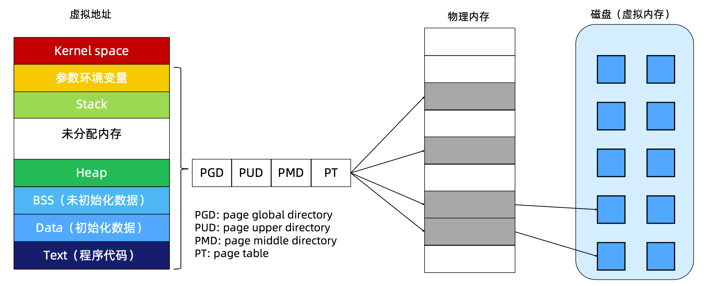
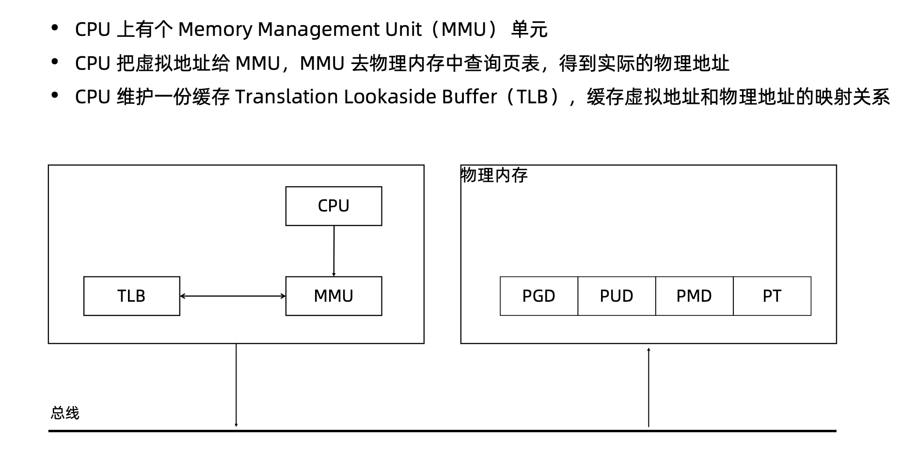
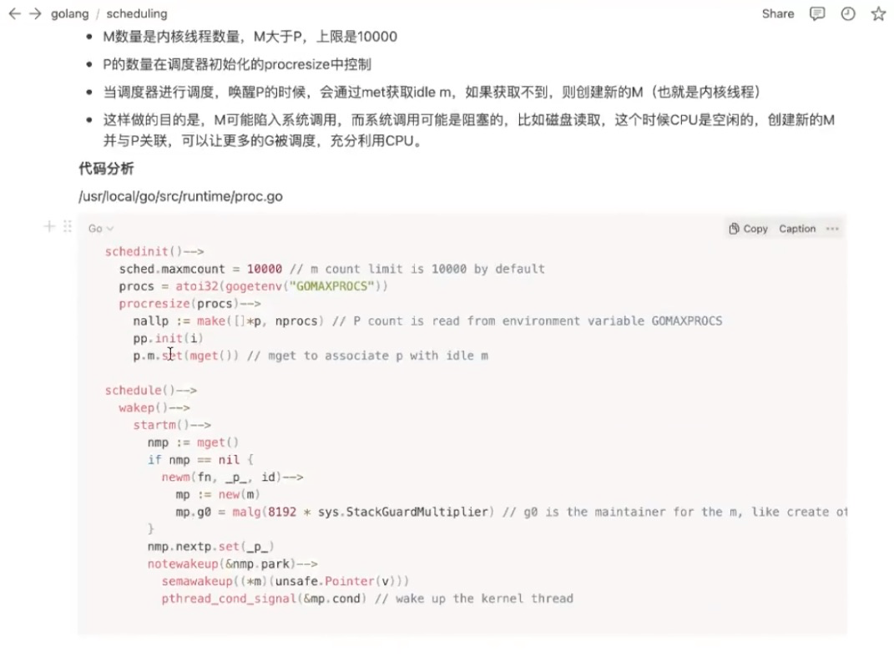

# 线程加锁

TODO sync包练习

# 线程调度

所有进程都是pid为1的进程fork出来的
pthread_create(clone_flags)
CLONE_VM | CLONE_FS | CLONE_FILES | CLONE_SIGHAND | CLONE_THREAD | CLONE_SYSTEM | CLONE_SETTLS | CLONE_PARENT_SETTID | CLONE_CHILD_CLEARTID

线程切换开销相对进程主要少了虚拟地址空间切换的开销

channel原理：https://juejin.cn/post/6844904016254599176
GMP：https://learnku.com/articles/41728

## M和P的关系

# 内存分配

TCMalloc :c的一种内存分配机制，不同span大小不同
GO语言内存分配：来自TCMalloc
TODO： 理解

# 内存回收

算法：引用计数、标记清除、标记整理、分代收集
mspan 结构
GC工作流程：
Mark: STW
Terminal Mark:STW
